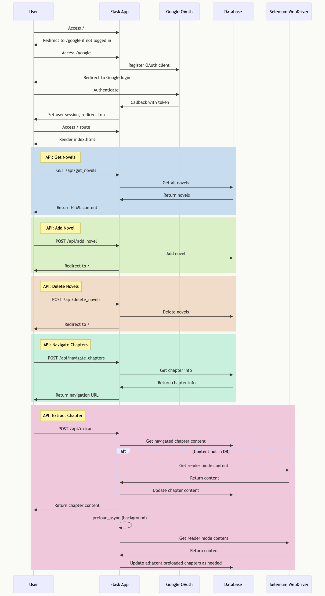

# Novel Reader

Novel Reader is a web application that allows users to manage their library of novels, track reading progress, and read chapters in a clean, distraction-free environment. The project implements a Flask backend with SQLite database, Selenium for web scraping, and a simple frontend using HTML, CSS, and JavaScript.

## Key Features

- User authentication with Google OAuth
- Library management (add, delete, view novels)
- Chapter navigation and reading
- Chapter content extraction in reader view mode
- Preloading of adjacent chapters for smooth reading experience
- Customizable display preferences (light/dark mode, font, font size)

## Tech Stack

- [Flask](https://flask.palletsprojects.com/)
- [SQLite](https://www.sqlite.org/)
- [Selenium](https://www.selenium.dev/)
- [Google OAuth](https://developers.google.com/identity/protocols/oauth2)
- [Bootstrap](https://getbootstrap.com/)

## Running Locally

<details>
<summary>Click to expand</summary>

1. Clone the repository:
   ```
   git clone https://github.com/joshuakojko/novel-reader.git
   ```

2. Navigate to the project directory:
   ```
   cd novel-reader
   ```

3. Set up a virtual environment:
   ```
   python -m venv .venv
   source .venv/bin/activate  # On Windows, use `.venv\Scripts\activate`
   ```

4. Install dependencies:
   ```
   pip install -r requirements.txt
   ```

5. Set up environment variables:
   Create a `.env` file in the root directory and add the following variables:
   ```
   SECRET_KEY=your_secret_key
   GOOGLE_CLIENT_ID=your_google_client_id
   ```

6. Set up Google OAuth credentials:
   - Go to the [Google Cloud Console](https://console.cloud.google.com/)
   - Create a new project or select an existing one
   - Create OAuth consent screen
   - Create OAuth 2.0 Client ID credentials (Web application type)
   - Add authorized redirect origin & redirect URIs (e.g., `http://localhost:8000` and `http://localhost:8000/google/auth`)
   - Save the Client ID and Client Secret

7. Store the Google Client Secret securely:
   ```
   python scripts/credential.py
   ```
   When prompted, enter:
   - Service name: `oauth`
   - Username: Your GOOGLE_CLIENT_ID
   - Password: Your Google GOOGLE_CLIENT_SECRET

8. Create the SQLite database:
   ```
   python scripts/create_db.py
   ```

9. Run the development server:
   ```
   python app/app.py
   ```

10. Open [http://localhost:8000](http://localhost:8000) in your browser.

</details>

## Documentation

### Sequence Diagram

## Project Structure
```
novel-reader/
├── app/
│   ├── __init__.py
│   ├── app.py
│   └── database.py
├── templates/
│   ├── index.html
│   └── extract.html
├── scripts/
│   ├── create_db.py
│   └── credential.py
├── docs/
│   └── app.mmd
├── .gitignore
├── README.md
└── requirements.txt
```

### Frontend
- `templates/index.html`: Library interface
- `templates/extract.html`: Reading interface

### Backend (Flask)
The main application logic is contained in `app/app.py`. It handles:
- User authentication with Google OAuth
- API endpoints for novel management and chapter navigation
- Content extraction using Selenium
- Preloading of adjacent chapters

### Database

SQLite is used for data storage, with database operations defined in `app/database.py`. It manages:

- User libraries
- Novel information
- Chapter content
- Display preferences


## Future Improvements